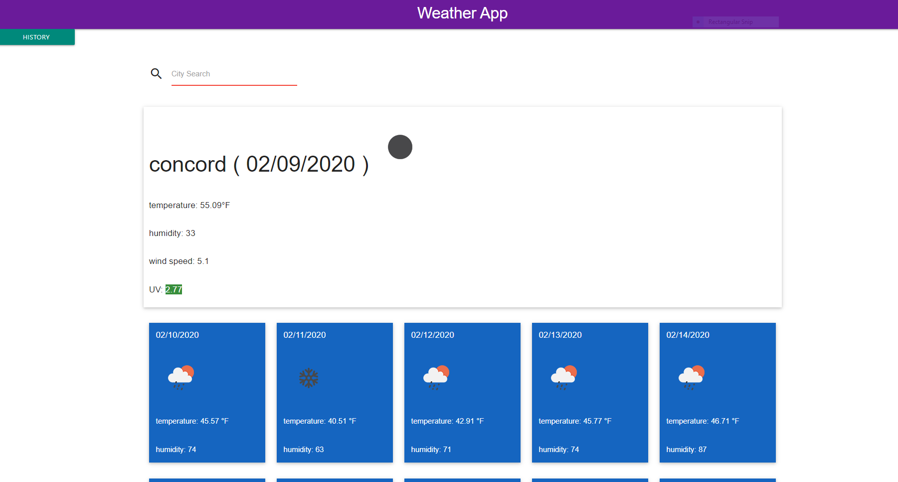

# weather-app

This projects goal was to make a weather dashbaord. The user can search a city and get the day break down and weekly forecast as well.
Every search is saved under history and allows the user to use past searches.
I appraoched this porject knowing the limits in api calls I could make. So to make each call matter coded all the parts using dummy data to ensure functionality per part I added.
Even with this apporach I still ran out of calls at times. So debugging

## Javascript

I used vuejs for te main app driver for htis project.
I ran into a problem when it came to ajax calls inside vue app object, but learned of the fetch functions in pure javascript.
So I learned it and I like it more than jquery's \$.get easy to debug and mess with data.
The libraries used in this porject were momentjs, vuejs, and javascript fetch.
The Past history is still kinda dumb so if you search city twice it will add it to the list so I'll fix that later but all functionality should be in place!

## CSS

Updating comming with a bit better lookin background and coloring choices. For tue most part his uses pure materialize.
I did have to code my own 5 column to the style.css so I could do the five day boxes, which I found some information on Stack Overflow that lead me in the right direction.
If you are wondering about the icons I used openweathers icon url to get their icons. Each weather event had their icon code and all I did was put the code in the url and was added into page using vuejs binding to src of image tags.

## App Link

[gitpages](https://trav-xeno.github.io/weather-app/)

## snapshot

